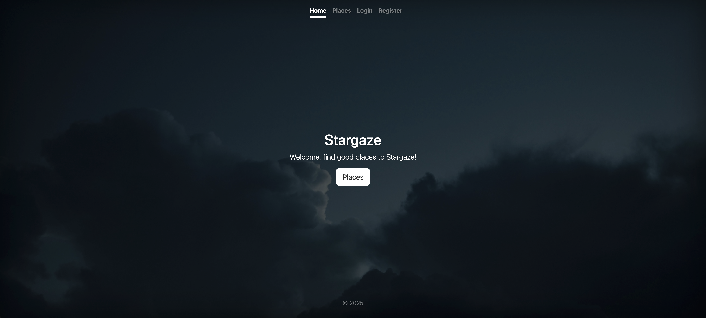
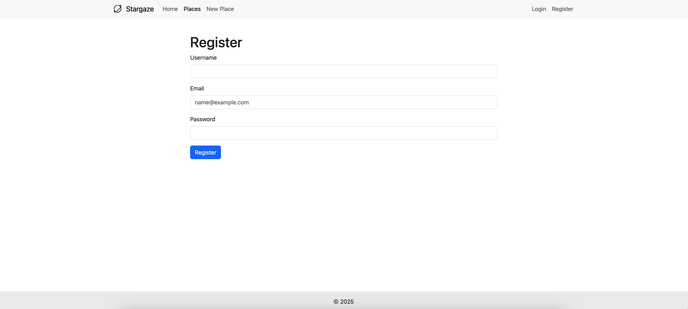
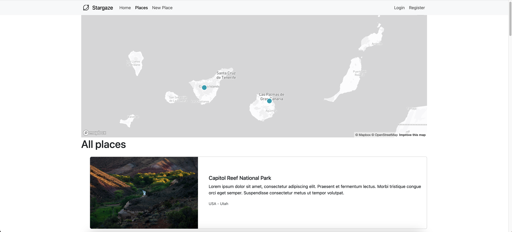
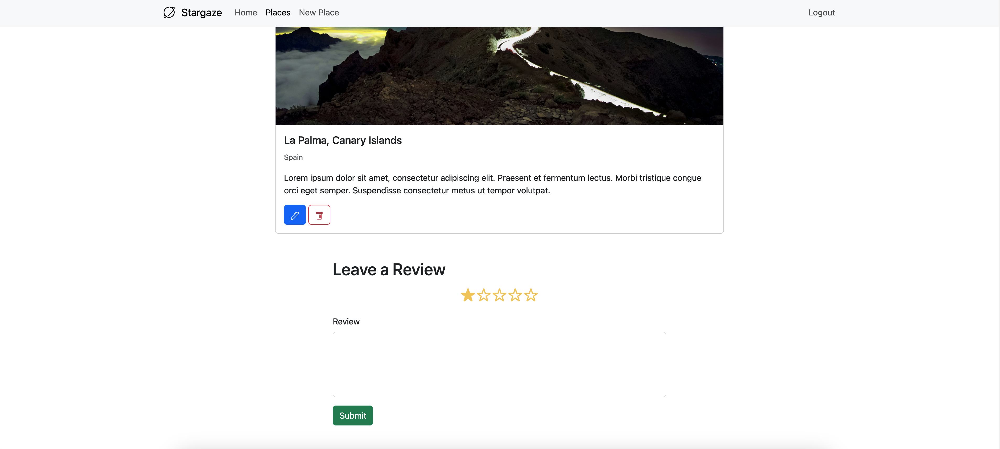
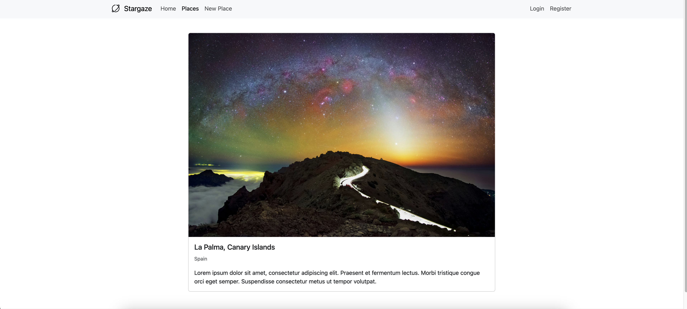
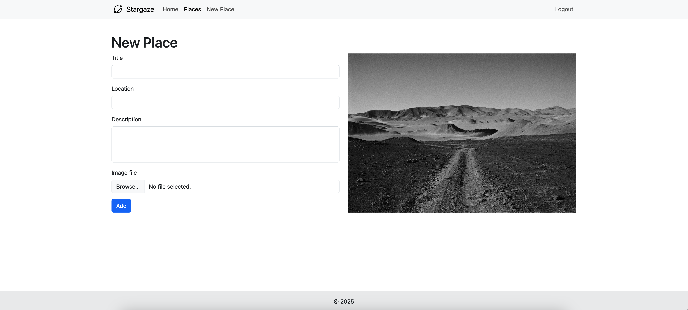

# Mainly Code along project [Udemy course](https://www.udemy.com/share/101W9C/).

## Home page.

Application that shows fantastic places for stargazing. The app allows one to register and perform all CRUD operations with respect to places. The main technologies used were Bootstrap, Node.js(Express.js), MongoDB and Passport.js.

## Register page

## Places page.

## Show place page - Actions.

Only logged-in users can add a review and a place.
Only the owner of the place can edit and/or remove it.

## Show place page.

## Add place page.

